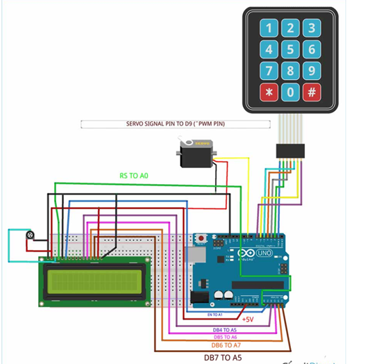

<h1 align="center">
Password-Based Door Lock System using Arduino
</h1>

## Project Overview
The Password-Based Door Lock System is a security-focused project that uses an Arduino microcontroller, a keypad, an LCD, and a servo motor to create a cost-effective and efficient door lock mechanism. This project aims to enhance security by restricting access using a password. It is applicable in homes, offices, and other secured areas.

---

## Motivation
Security is a primary concern in today's society. This project was motivated by the need for enhanced security mechanisms that are both effective and low-cost. By implementing a password-based door lock system using an Arduino microcontroller, we aim to provide a practical solution for safeguarding valuables and restricted areas against unauthorized access.

---

## Theory
The main components of this project are an Arduino UNO board, a servo motor, an LCD, and a keypad. The Arduino controls the servo motor, which locks or unlocks the door. The 16x2 LCD displays messages, and the keypad provides input for the password. The system operates by comparing user input with a predefined password, unlocking the door if they match and denying access otherwise.

---

## Required Components
- **Arduino Uno (ATmega 328p)**
- **16x2 LCD Display**
- **4x3 Matrix Keypad**
- **Servo Motor**
- **Breadboard**
- **Potentiometer (5kΩ)**
- **Power Supply Cable**
- **Steel Door Latch**
- **Jumper Wires**
- **Ceiling Board**
- **Black Tape**
- **Steel Wire**

---

## Circuit Diagram
<h1 align="center">
   
</h1>

---


## Arduino Code:
```c
#include <Keypad.h>
#include <LiquidCrystal.h>
#include <Servo.h>

Servo myservo;
LiquidCrystal lcd(A0, A1, A2, A3, A4, A5);

#define Password_Lenght 7 

int pos = 0;  
char Data[Password_Lenght]; 
char Master[Password_Lenght] = "123456";
byte data_count = 0, master_count = 0;
bool Pass_is_good;
char customKey;

const byte ROWS = 4;
const byte COLS = 3;
char keys[ROWS][COLS] = {
  {'1', '2', '3'},
  {'4', '5', '6'},
  {'7', '8', '9'},
  {'*', '0', '#'}  
};
bool door = true;
byte rowPins[ROWS] = {1, 2, 3, 4}; 
byte colPins[COLS] = {5, 6, 7}; 
Keypad customKeypad(makeKeymap(keys), rowPins, colPins, ROWS, COLS); 

void setup() {
  myservo.attach(9);
  ServoClose();
  lcd.begin(16, 2);
  lcd.print(" Arduino Door");
  lcd.setCursor(0, 1);
  lcd.print("--Look project--");
  delay(3000);
  lcd.clear();
}

void loop() {
  if (door == 0) {
    customKey = customKeypad.getKey();
    if (customKey == '#') {
      lcd.clear();
      ServoClose();
      lcd.print("  Door is close");
      delay(3000);
      door = 1;
    }
  } else {
    Open();
  }
}

void clearData() {
  while (data_count != 0) {
    Data[data_count--] = 0; // Clear array for new data
  }
  return;
}

void ServoOpen() {
  for (pos = 180; pos >= 0; pos -= 5) {
    myservo.write(pos);              // Tell servo to go to position in variable 'pos'
    delay(15);                       // Waits 15ms for the servo to reach the position
  }
}

void ServoClose() {
  for (pos = 0; pos <= 180; pos += 5) { // Goes from 180 degrees to 0 degrees
    myservo.write(pos);              // Tell servo to go to position in variable 'pos'
    delay(15);                       // Waits 15ms for the servo to reach the position
  }
}

void Open() {
  lcd.setCursor(0, 0);
  lcd.print(" Enter Password");  
  customKey = customKeypad.getKey();
  if (customKey) { // Makes sure a key is actually pressed
    Data[data_count] = customKey; // Store char into data array
    lcd.setCursor(data_count, 1); // Move cursor to show each new char
    lcd.print(Data[data_count]); // Print char at said cursor
    data_count++;
  }
  if (data_count == Password_Lenght - 1) {
    if (!strcmp(Data, Master)) { // Check if entered password matches the stored password
      lcd.clear();
      ServoOpen();
      lcd.print("  Door is Open");
      door = 0;
    } else {
      lcd.clear();
      lcd.print("  Wrong Password");
      delay(1000);
      door = 1;
    }
    clearData();
  }
}
```

---

## Procedure
1. **System Assembly**  
   All components were fitted onto a 10x12 inch plastic box, powered using a mobile charger or laptop. The servo motor was first fixed and connected to a normal slide lock using a metal wire. This was followed by fitting the LCD display below the lock mechanism. Arduino and the breadboard were placed behind the setup, and the components were interconnected using jumpers as per the circuit diagram.

2. **System Initialization**  
   Upon powering up, the system displays a project name or company branding on the LCD for a smart, professional look. This is followed by a 3-second delay, during which the system locks the door and updates the display.

3. **User Interaction**  
   The door can be manually locked using the `#` key on the keypad, prompting a "Door is closed" message. To unlock, the user must enter the correct password. The system then displays "Door is open" if access is granted.

<h1 align="center">
   
</h1>
<h1 align="center">
   
</h1>

---

## Applications
- Main door security for homes
- Bank lockers
- Personal room access control
- Control rooms for various companies
- Office main door security

---

## Project Challenges
1. Initial program errors were resolved after thorough debugging.
2. The use of thin wire for locking mechanisms resulted in low accuracy; replacing it with a more robust metal would enhance performance.

---

## Discussion and Conclusion
This project addresses security concerns for homes and offices by using a password-based access control system. A keypad provides user input, while a servo motor, controlled by the Arduino, manages the locking and unlocking of a door. Access is granted only when the entered password matches the predefined password in the Arduino code. This ensures that unauthorized individuals cannot gain entry, thereby enhancing security.

---
